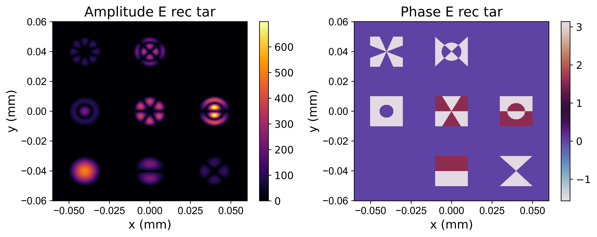
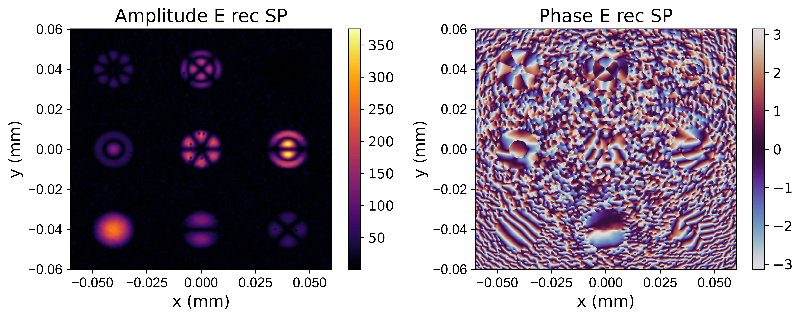
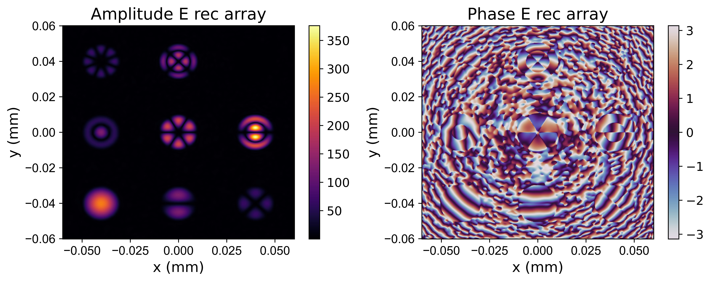
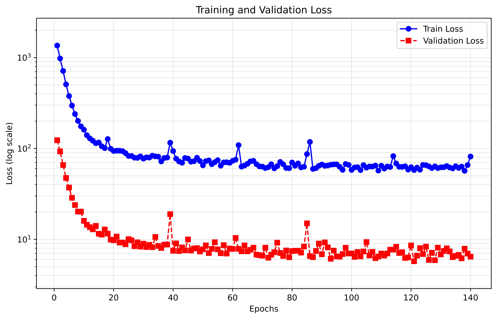
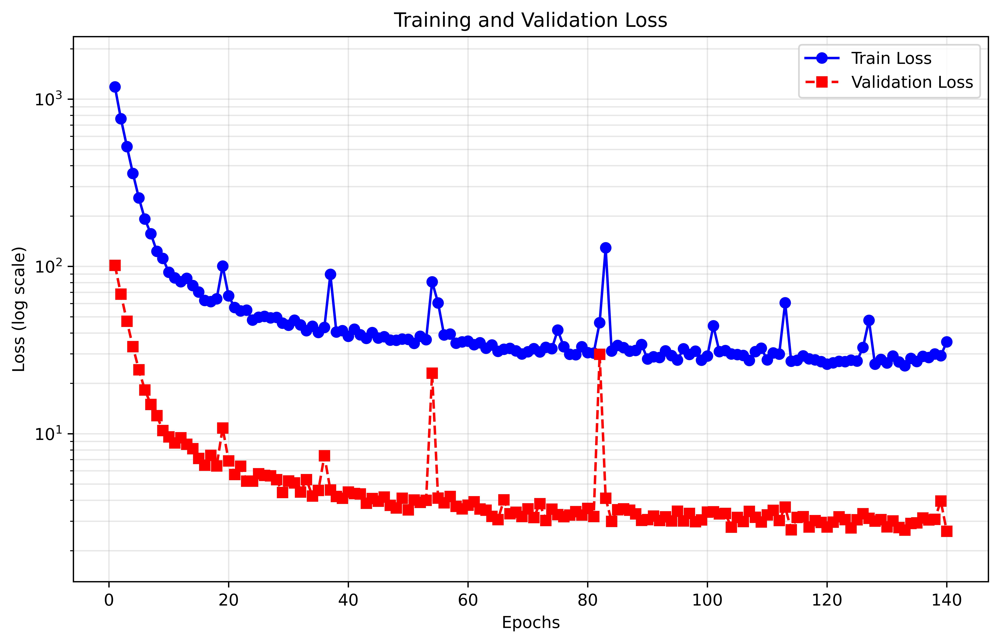

# DNN-PPD

**DNN-PPD** is an open-source Python repository for mode-profile-preserved demultiplexing based on diffractive neural networks.

This project focuses on all-optical fiber-mode demultiplexing with holographic phase design. It includes fiber optical-field definition, encoding-phase design, demultiplexing-phase design, output analysis, and visualization. The encoding phase converts an input Gaussian beam into a specified complex-amplitude optical field, while the demultiplexing phase separates fiber modes while preserving their output mode profiles.

**Author:** Rundong Fan

## Demonstration Results

The figures below are generated by `main/Mode_division_ONN_comparison.py`. This script compares two diffractive neural network initialization/design strategies:

- spherical phase based design
- microlens-array phase based design

The outputs include comparisons between target mode profiles and recovered demultiplexing results, followed by the corresponding convergence curves.

### Target Mode Profiles



### Spherical Phase Based Recovery



### Microlens-Array Phase Based Recovery



### Convergence Curves





## Repository Contents

- `main/`: public example and test scripts. Usage notes are marked above the corresponding test functions.
- `fiber/`: fiber-mode calculation and SLM-related simulation utilities. These modules can be reused in multimode-fiber research.
- `ONNtrain/`: diffractive neural network models, propagation modules, trainers, and inference utilities for mode demultiplexing.
- `utils/`: shared plotting, propagation, phase-saving, mode-placement, normalization, and analysis helper functions.
- `Mode/`: amplitude-distribution images of the first 16 fiber modes, computed with the fiber-mode calculation functions in `fiber/` and provided as reference mode-profile resources.
- `Pre_trained_DNN/`: pretrained holographic phase files for reproducing selected demultiplexing designs.
- `Sim_Result/`: representative output figures generated from the comparison script.
- `requirements.txt`: Python package requirements used in the development environment.

## Installation

Install the Python dependencies with:

```bash
pip install -r requirements.txt
```

The provided `requirements.txt` uses the CUDA 12.8 builds of PyTorch and torchvision. For a CPU-only environment or a different CUDA version, install the appropriate PyTorch packages for your system.

## Public Scripts

The public scripts are located in `main/`. Usage notes are included above the corresponding test functions.

- `Calibration_pattern.py`: generates multi-plane reflection alignment holographic phase patterns.
- `Mode_encoding_SLM_design.py`: generates SLM encoding patterns from mode coefficients.
- `Mode_frequency_analysis.py`: analyzes the spatial-frequency content of fiber modes.
- `Single_mode_division_ONN_design.py`: designs and tests a single-mode demultiplexing optical neural network.
- `Single_mode_generation_SLM.py`: generates encoded SLM patterns for single-mode distributions.
- `Mode_division_ONN_comparison.py`: compares spherical phase and microlens-array phase based ONN designs.
- `SLM_ONN_phase_design.py`: designs and exports full-resolution SLM phases for an ONN using the real SLM geometry.
- `Few_mode_fiber_SLM_ONN_design.py`: designs, trains, and exports a few-mode-fiber SLM ONN for the fiber experiment.

## Features

- Definition and generation of fiber optical fields
- Reference amplitude distributions for the first 16 fiber modes
- Holographic phase design based on diffractive neural networks
- Encoding phase design for converting Gaussian beams into target complex-amplitude optical fields
- Demultiplexing phase design for mode-profile-preserved fiber-mode separation
- Comparison between spherical phase and microlens-array phase based ONN designs
- Output analysis and visualization

## Pretrained Holographic Phases

This repository provides pretrained `.pth` files for fiber-mode demultiplexing holographic phase design, including 4-mode and 8-mode demultiplexing examples.

These pretrained files can be used to reproduce the corresponding mode-profile-preserved demultiplexing results.

The public scripts directly reference:

- `modulator_Simulation_Singlemode_4layer.pth`
- `modulator_comparison_8lemode_4layer_SP_1000.pth`
- `modulator_comparison_8lemode_4layer_array_1000.pth`
- `modulator_slm_semantice_3layer_paper_result.pth`
- `modulator_slm_semantice_3layer_paper_result_fibre.pth`

Additional comparison model versions are also included:

- `modulator_comparison_8lemode_4layer_SP.pth`
- `modulator_comparison_8lemode_4layer_array.pth`

## Code Availability

The source code and pretrained holographic phase files will be released and continuously updated at:

https://github.com/THUAO-Lab/DNN-PPD

## Status

This repository is under active development. Code, pretrained phase files, examples, and documentation will be continuously updated.
